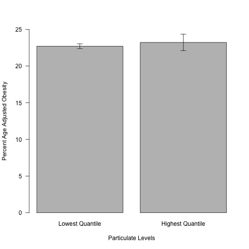

Investigations into the Epidemiology of Particulate Matter and Obesity
=========================================================================


Obesity Data
-------------

The PM2.5 data was downloaded from http://www.cdc.gov/diabetes/atlas/countydata/OBPREV/OB_PREV_ALL_STATES.xls and saved to ../data/raw/obesity_prevalance_all_states.xls.

According to these data, the counties with the highest age adjusted percent obesity are:

<!-- html table generated in R 3.1.0 by xtable 1.7-3 package -->
<!-- Sat May 17 12:43:59 2014 -->
<TABLE border=1>
<CAPTION ALIGN="bottom"> Top 5 Counties by Age-Adjusted Obesity </CAPTION>
<TR> <TH>  </TH> <TH> County </TH> <TH> obesity.mean </TH>  </TR>
  <TR> <TD align="right"> 405 </TD> <TD> Corson County </TD> <TD align="right"> 37.20 </TD> </TR>
  <TR> <TD align="right"> 1217 </TD> <TD> Noxubee County </TD> <TD align="right"> 35.80 </TD> </TR>
  <TR> <TD align="right"> 1644 </TD> <TD> Tallahatchie County </TD> <TD align="right"> 35.70 </TD> </TR>
  <TR> <TD align="right"> 1249 </TD> <TD> Orangeburg County </TD> <TD align="right"> 35.50 </TD> </TR>
  <TR> <TD align="right"> 1705 </TD> <TD> Tunica County </TD> <TD align="right"> 35.30 </TD> </TR>
  <TR> <TD align="right"> 227 </TD> <TD> Bullock County </TD> <TD align="right"> 35.10 </TD> </TR>
   </TABLE>


Particulate Data
--------------------

The PM2.5 data was downloaded from http://aqsdr1.epa.gov/aqsweb/aqstmp/airdata/annual_all_1990.zip and saved to ../data/raw/annual_all_1990.csv.  According to this, in 1990 the counties with the highest particulate matter levels were:

<!-- html table generated in R 3.1.0 by xtable 1.7-3 package -->
<!-- Sat May 17 12:43:59 2014 -->
<TABLE border=1>
<CAPTION ALIGN="bottom"> Top 5 Counties by PM10 Levels in 1990 </CAPTION>
<TR> <TH>  </TH> <TH> County.Name </TH> <TH> pm10.mean </TH>  </TR>
  <TR> <TD align="right"> 94 </TD> <TD> CHIHUAHUA STATE </TD> <TD align="right"> 82.48 </TD> </TR>
  <TR> <TD align="right"> 230 </TD> <TD> Klamath </TD> <TD align="right"> 80.17 </TD> </TR>
  <TR> <TD align="right"> 104 </TD> <TD> Cochise </TD> <TD align="right"> 73.45 </TD> </TR>
  <TR> <TD align="right"> 165 </TD> <TD> Fresno </TD> <TD align="right"> 71.79 </TD> </TR>
  <TR> <TD align="right"> 245 </TD> <TD> Lemhi </TD> <TD align="right"> 67.78 </TD> </TR>
  <TR> <TD align="right"> 460 </TD> <TD> Tulare </TD> <TD align="right"> 66.17 </TD> </TR>
   </TABLE>


Combined Data
--------------

  


The data were not normally distributed (age adjusted obesity, p=6.5465 &times; 10<sup>-10</sup>; particulate matter levels p=1.1425 &times; 10<sup>-18</sup>), so we calculated the correlation coefficient using Spearman's Rank-Based test, which yielded rho=0.1093, rho<sup>2</sup>=0.0119 and p=0.0187


 


We looked at the differences between the upper and lower quantiles of PM<sub>10</sub> levels, and found no difference between the age adjusted obesity rates between these groups by a Wilcoxon Rank Sum Test (p=0.9813).

Session Information
-------------------


```r
sessionInfo()
```

```
## R version 3.1.0 (2014-04-10)
## Platform: x86_64-apple-darwin13.1.0 (64-bit)
## 
## locale:
## [1] en_US.UTF-8/en_US.UTF-8/en_US.UTF-8/C/en_US.UTF-8/en_US.UTF-8
## 
## attached base packages:
## [1] stats     graphics  grDevices utils     datasets  methods   base     
## 
## other attached packages:
## [1] xtable_1.7-3   xlsx_0.5.5     xlsxjars_0.6.0 rJava_0.9-6   
## [5] plyr_1.8.1     knitr_1.5     
## 
## loaded via a namespace (and not attached):
## [1] evaluate_0.5.5 formatR_0.10   Rcpp_0.11.1    stringr_0.6.2 
## [5] tools_3.1.0
```

